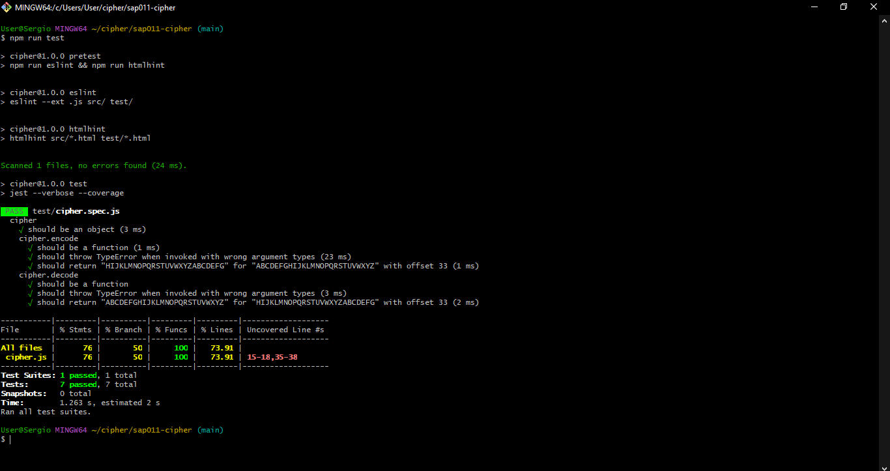

# Secret Message - Cifra de César

## Índice

* [1. Introdução ao Projeto](#1-Introdução)
* [2. Resumo](#2-Resumo)
* [3. Protótipo](#3-protótipo)
* [4. Experiência](#4-experiência)
* [5. Tecnologias utilizadas](#6-tecnologias-utilizadas)
* [6. Interface](#7-interface)
* [7. Teste](#8-teste)
* [8. Para considerar o feedback do projeto](#9-para-considerar-o-feedback-do-projeto)
* [9.Desenvolvedora](#10-desenvolvedora)

***

## 1. Introdução ao Projeto

Encriptar significa ocultar o conteúdo de uma mensagem a olho nu,
para que somente as partes autorizadas possam decifrar um texto cifrado.
A [cifra de César](https://pt.wikipedia.org/wiki/Cifra_de_C%C3%A9sar)
é um dos primeiros tipos de criptografias conhecidas na história.
O imperador romano Júlio César utilizava essa cifra para enviar
ordens secretas aos seus generais no campo de batalha.

A cifra de César é uma das técnicas mais simples de cifrar uma mensagem. É um
tipo de cifra por substituição, em que cada letra do texto original é
substituida por outra que se encontra há um número fixo de posições
(deslocamento) mais a frente do mesmo alfabeto.

Por exemplo se usarmos o deslocamento (_offset_) de 3 posições:

* Alfabeto sem cifrar: A B C D E F G H I J K L M N O P Q R S T U V W X Y Z
* Alfabeto com cifra:  D E F G H I J K L M N O P Q R S T U V W X Y Z A B C
* A letra A será D
* A palavra CASA será FDVD

## 2. Resumo

Esta é a minha primeira aplicação como desenvolvedora web fornt-end no bootcamp do Laboratória.

## 3. Protótipo

## 4. Experiência do Usuário

Este website Secret Message é uma ferramenta criativa, especialmente desenvolvida para jovens mulheres em relacionamentos homoafetivos que buscam privacidade e segurança na comunicação com suas parceiras. A plataforma é intuitiva, permitindo que usuárias codifiquem e decodifiquem mensagens de forma discreta, garantindo que suas conversas privadas permaneçam protegidas.

O site tem personalização da criptografia, onde as usuárias têm a liberdade de escolher o número de deslocamentos para codificar suas mensagens, utilizando tanto letras maiúsculas quanto minúsculas. Este recurso não apenas reforça a segurança, mas também adiciona diversão, tornando a comunicação uma experiência única e pessoal, adaptada às necessidades específicas de cada usuária em sua jornada por autenticidade e conexão.

## 5. Tecnologias

## 6. Interface

## 7. Teste

## 8. Link

Clique [aqui](https://laiscosta25.github.io/SAP011-cipher/src/) para visitar a página.

## 9. Onde me encontrar

Github clique [aqui](https://laiscosta25.github.io/).

Linkedin clique [aqui](https://www.linkedin.com/in/la%C3%ADs-costa-859084265/).
